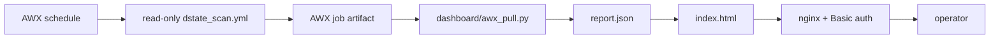

# D-State Fleet Monitor — Public Design

## Problem

Linux `D` state means a process is blocked in uninterruptible kernel I/O. A few short-lived entries can be normal; many long-lived entries usually point to storage, NFS, or block-device trouble. The monitor gives operators a single fleet view before users report a hang.

## Chosen architecture

- AWX owns SSH credentials and inventory access.
- Target hosts are not modified; the playbook only runs `ps` and `last`.
- The dashboard host needs only an AWX token and the Job Template ID.
- The published surface is static HTML, usually served at `https://monitor.example.com/dstate/` behind Basic auth.

## Data flow

1. AWX launches `dstate-fleet-scan` on a schedule, typically every 30 minutes.
2. `awx/dstate_scan.yml` collects D-state process rows per host and stores a compact `dstate_hosts` artifact.
3. `dashboard/awx_pull.py` reads the latest full-fleet AWX job plus host summaries for unreachable hosts.
4. `dashboard/render_dashboard.py` renders `report.json` to a self-contained `index.html`.
5. Optional `dashboard/dstate_web.py` serves the dashboard and launches a single-host rescan using AWX `limit=<host>`.

## Safety boundaries

- Read-only scan: no package installs, service restarts, or file changes on monitored hosts.
- `become: false` by default.
- Finite command and job timeouts keep hung hosts from wedging the schedule.
- Secrets live in `dashboard/config.env`, which is ignored by git.
- Process args are masked for common token/password patterns before reports are written.

## Demo inventory

`awx/inventory.demo.yml` contains only synthetic example hosts (`web-01.example.com`, `db-01.example.com`, `nfs-01.example.com`). Replace it with your private AWX inventory in production; do not commit real inventory files.
